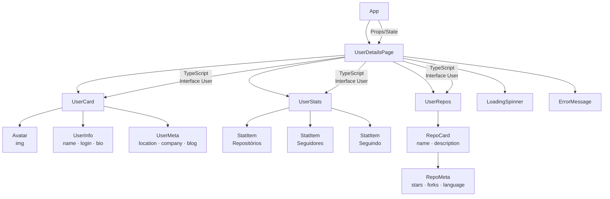
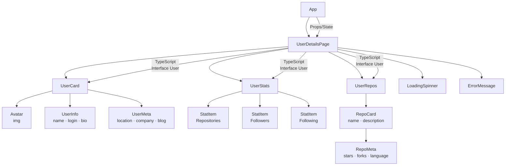

# Criando a Pagina Com os Detalhes do Usuario Com React

<div align="center">


</div>

---

Este projeto foi desenvolvido por Gabriel Demetrios Lafis como parte de um desafio prático da **DIO (Digital Innovation One)**, aplicando **React** e **TypeScript** para criar uma página de detalhes de usuário com dados dinâmicos e componentes reutilizáveis.

## 🎯 O Desafio

Construir uma página de detalhes de usuário em React com TypeScript, praticando componentização, tipagem estática e consumo de dados. O projeto vai além da replicação, adicionando melhorias reais de estrutura, lógica e boas práticas de desenvolvimento.

## 🛠 Tecnologias Utilizadas

- React
- TypeScript
- Node.js
- Git e GitHub

## 🗺️ Hierarquia de Componentes React



## 🚀 Repositório Base

Projeto inspirado no repositório oficial:
[https://github.com/digitalinnovationone/desafio03-ts](https://github.com/digitalinnovationone/desafio03-ts)

## ▶️ Como Executar

```bash
npm install
npm run build
npm start
```

## 📋 Descrição

Este repositório contém o código-fonte de uma página de detalhes de usuário construída com React e TypeScript. A aplicação exibe informações detalhadas de um perfil de usuário, incluindo avatar, nome, biografia, estatísticas (repositórios, seguidores, seguindo) e lista de repositórios públicos. A tipagem com TypeScript garante maior segurança e previsibilidade no fluxo de dados entre os componentes.

## 📦 Instalação

1. **Clone o repositório:**
   ```bash
   git clone https://github.com/galafis/Criando-a-Pagina-Com-os-Detalhes-do-Usuario-Com-React.git
   ```
2. **Navegue até o diretório do projeto:**
   ```bash
   cd Criando-a-Pagina-Com-os-Detalhes-do-Usuario-Com-React
   ```
3. **Instale as dependências:**
   ```bash
   npm install
   ```

## 💻 Uso

```bash
npm start
```

Acesse `http://localhost:3000` no navegador para visualizar a aplicação. A página exibirá os detalhes do usuário com todos os componentes React tipados e organizados em hierarquia.

## 📄 Licença

Este projeto está licenciado sob a Licença MIT. Consulte o arquivo `LICENSE` para mais detalhes.

---

**Autor:** Gabriel Demetrios Lafis

---

# Creating the User Details Page with React

This project was developed by Gabriel Demetrios Lafis as part of a practical challenge from **DIO (Digital Innovation One)**, applying **React** and **TypeScript** to build a user details page with dynamic data and reusable components.

## 🎯 The Challenge

Build a user details page in React with TypeScript, practicing componentization, static typing, and data consumption. The project goes beyond replication, adding real improvements in structure, logic, and development best practices.

## 🛠 Technologies Used

- React
- TypeScript
- Node.js
- Git and GitHub

## 🗺️ React Component Hierarchy



## 🚀 Base Repository

Project inspired by the official repository:
[https://github.com/digitalinnovationone/desafio03-ts](https://github.com/digitalinnovationone/desafio03-ts)

## ▶️ How to Run

```bash
npm install
npm run build
npm start
```

## 📋 Description

This repository contains the source code for a user details page built with React and TypeScript. The application displays detailed information of a user profile, including avatar, name, bio, statistics (repositories, followers, following), and a list of public repositories. TypeScript typing ensures greater safety and predictability in the data flow between components.

## 📦 Installation

1. **Clone the repository:**
   ```bash
   git clone https://github.com/galafis/Criando-a-Pagina-Com-os-Detalhes-do-Usuario-Com-React.git
   ```
2. **Navigate to the project directory:**
   ```bash
   cd Criando-a-Pagina-Com-os-Detalhes-do-Usuario-Com-React
   ```
3. **Install dependencies:**
   ```bash
   npm install
   ```

## 💻 Usage

```bash
npm start
```

Access `http://localhost:3000` in your browser to view the application. The page will display user details with all React components typed and organized in hierarchy.

## 📄 License

This project is licensed under the MIT License. See the `LICENSE` file for more details.

---

**Author:** Gabriel Demetrios Lafis


---

## English

### Overview

Criando a Pagina Com os Detalhes do Usuario Com React - A project built with TypeScript, React, Node.js, developed by Gabriel Demetrios Lafis as part of professional portfolio and continuous learning in Data Science and Software Engineering.

### Key Features

This project demonstrates practical application of modern development concepts including clean code architecture, responsive design patterns, and industry-standard best practices. The implementation showcases real-world problem solving with production-ready code quality.

### How to Run

1. Clone the repository:
   ```bash
   git clone https://github.com/galafis/Criando-a-Pagina-Com-os-Detalhes-do-Usuario-Com-React.git
   ```
2. Follow the setup instructions in the Portuguese section above.

### License

This project is licensed under the MIT License. See the [LICENSE](LICENSE) file for details.

---

Developed by [Gabriel Demetrios Lafis](https://github.com/galafis)
