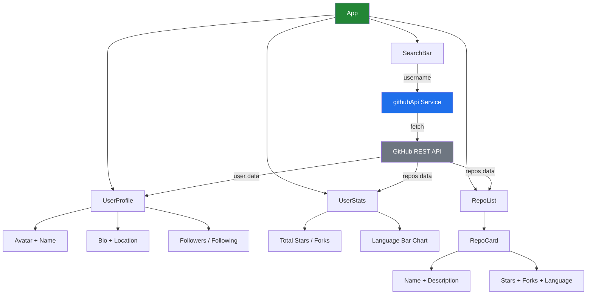

# Criando a Pagina Com os Detalhes do Usuario Com React

<div align="center">


</div>

---

## Portugues

### Visao Geral

Aplicacao React que consome a API publica do GitHub para exibir perfis de usuarios, estatisticas de repositorios e detalhes de contribuicoes. O usuario pode pesquisar qualquer perfil do GitHub e visualizar informacoes detalhadas incluindo avatar, biografia, repositorios publicos, linguagens mais utilizadas, total de estrelas e forks.

### Arquitetura


```mermaid
graph TD
    A[App] --> B[SearchBar]
    A --> C[UserProfile]
    A --> D[UserStats]
    A --> E[RepoList]

    B -->|username| F[githubApi Service]
    F -->|fetch| G[GitHub REST API]
    G -->|user data| C
    G -->|repos data| D
    G -->|repos data| E

    C --> C1[Avatar + Name]
    C --> C2[Bio + Location]
    C --> C3[Followers / Following]

    D --> D1[Total Stars / Forks]
    D --> D2[Language Bar Chart]

    E --> E1[RepoCard]
    E1 --> E1a[Name + Description]
    E1 --> E1b[Stars + Forks + Language]

    style A fill:#238636,color:#fff
    style F fill:#1f6feb,color:#fff
    style G fill:#6e7681,color:#fff
```

### Funcionalidades

- Busca de usuarios pelo nome de usuario do GitHub
- Exibicao de perfil completo (avatar, nome, bio, empresa, localizacao, blog)
- Estatisticas agregadas (total de estrelas, forks, repositorios originais, linguagens)
- Barra visual de linguagens mais utilizadas
- Grade de repositorios com nome, descricao, linguagem, estrelas e forks
- Sugestoes de usuarios populares na tela inicial
- Tratamento de erros (usuario nao encontrado, limite de taxa da API)
- Interface responsiva com tema escuro inspirado no GitHub

### Estrutura do Projeto

```
src/
  App.jsx                  # Componente principal com gerenciamento de estado
  index.js                 # Ponto de entrada React
  components/
    SearchBar.jsx           # Formulario de busca de usuarios
    UserProfile.jsx         # Card de perfil do usuario
    UserStats.jsx           # Estatisticas e barra de linguagens
    RepoList.jsx            # Grade de repositorios
  services/
    githubApi.js            # Servico de comunicacao com a API do GitHub
public/
  index.html               # HTML principal
```

### Como Executar

```bash
npm install
npm start
```

Acesse `http://localhost:3000` no navegador.

### Tecnologias

- **React 18** - Biblioteca de interface de usuario com componentes funcionais e hooks
- **GitHub REST API** - API publica para dados de usuarios e repositorios
- **CSS-in-JS** - Estilizacao inline com objetos JavaScript
- **Fetch API** - Requisicoes HTTP nativas do navegador

---

**Autor:** Gabriel Demetrios Lafis

---

## English

### Overview

React application that consumes the public GitHub API to display user profiles, repository statistics, and contribution details. Users can search for any GitHub profile and view detailed information including avatar, bio, public repositories, most used languages, total stars, and forks.

### Architecture


```mermaid
graph TD
    A[App] --> B[SearchBar]
    A --> C[UserProfile]
    A --> D[UserStats]
    A --> E[RepoList]

    B -->|username| F[githubApi Service]
    F -->|fetch| G[GitHub REST API]
    G -->|user data| C
    G -->|repos data| D
    G -->|repos data| E

    C --> C1[Avatar + Name]
    C --> C2[Bio + Location]
    C --> C3[Followers / Following]

    D --> D1[Total Stars / Forks]
    D --> D2[Language Bar Chart]

    E --> E1[RepoCard]
    E1 --> E1a[Name + Description]
    E1 --> E1b[Stars + Forks + Language]

    style A fill:#238636,color:#fff
    style F fill:#1f6feb,color:#fff
    style G fill:#6e7681,color:#fff
```

### Features

- Search users by GitHub username
- Complete profile display (avatar, name, bio, company, location, blog)
- Aggregated statistics (total stars, forks, original repos, languages)
- Visual language usage bar
- Repository grid with name, description, language, stars, and forks
- Popular user suggestions on the home screen
- Error handling (user not found, API rate limit)
- Responsive interface with GitHub-inspired dark theme

### Project Structure

```
src/
  App.jsx                  # Main component with state management
  index.js                 # React entry point
  components/
    SearchBar.jsx           # User search form
    UserProfile.jsx         # User profile card
    UserStats.jsx           # Statistics and language bar
    RepoList.jsx            # Repository grid
  services/
    githubApi.js            # GitHub API communication service
public/
  index.html               # Main HTML
```

### How to Run

```bash
npm install
npm start
```

Open `http://localhost:3000` in your browser.

### Technologies

- **React 18** - UI library with functional components and hooks
- **GitHub REST API** - Public API for user and repository data
- **CSS-in-JS** - Inline styling with JavaScript objects
- **Fetch API** - Native browser HTTP requests

---

**Author:** Gabriel Demetrios Lafis

---

## License

This project is licensed under the MIT License. See the [LICENSE](LICENSE) file for details.

Developed by [Gabriel Demetrios Lafis](https://github.com/galafis)
